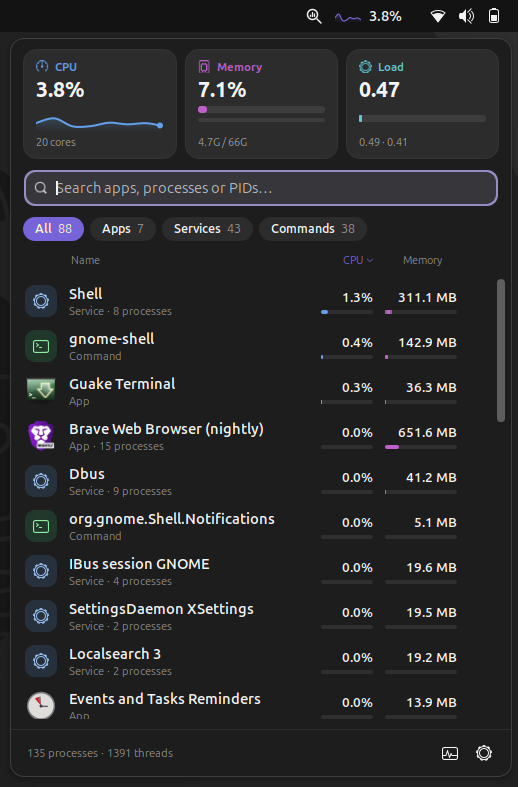
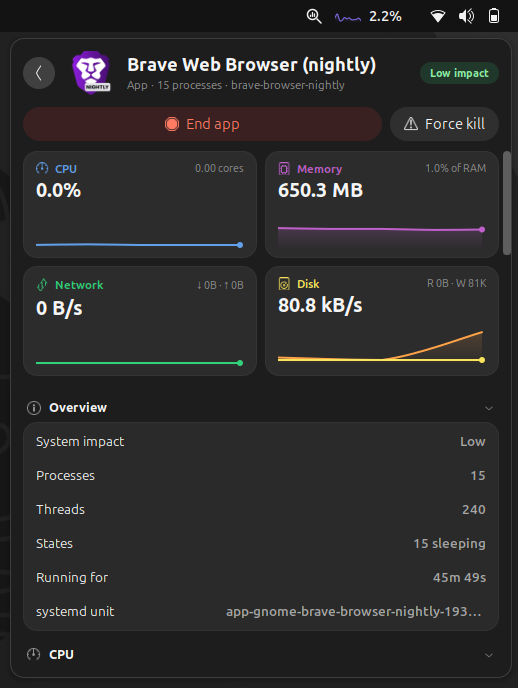

# Appsight

**See every running app from the GNOME top bar and end the ones you don't want.**

Appsight is a GNOME Shell extension that adds a small process monitor to the
top bar. Hover the icon to see what's running, grouped the way you think about it:
one entry per app, however many helper processes it starts. Click an app for live
graphs and details, or end it with one click.

<p align="center">
  
  
</p>

- [Features](#features)
- [Install](#install)
- [How to use it](#how-to-use-it)
- [Settings](#settings)
- [What the numbers mean](#what-the-numbers-mean)
- [Troubleshooting & FAQ](#troubleshooting--faq)
- [Privacy and resource use](#privacy-and-resource-use)
- [Uninstall](#uninstall)
- [For developers](#for-developers)
- [License](#license)

---

## Features

- **One entry per app.** Brave's 20 helper processes show up as one "Brave" row with
  combined CPU and memory, not 20 identical lines.
- **Live at a glance.** CPU or memory usage (and a tiny graph) next to the top-bar
  icon; CPU, memory and load cards at the top of the menu.
- **Find things fast.** Search by app name, process name or PID. Filter by *Apps*,
  *Services* or *Commands*. Sort by CPU, memory or name. Usage bars show who's
  heaviest.
- **Details for every app.** Live CPU, memory, network and disk graphs, plus:
  - CPU time, cores in use, context switches, time spent waiting for the CPU
  - memory breakdown (private, proportional, resident, shared, swapped)
  - page cache charged to the app and the size of its cache folder
  - disk read/write speed and totals
  - network download/upload speed, connections, listening ports, top remote hosts
  - disk space used by the app (installation, settings, data, cache)
  - open files, sockets and pipes
  - every process of the app, labelled by role for browsers and Electron apps
    (*renderer*, *GPU*, *network service*, …)
- **End apps cleanly.** *End app* asks every process to quit, waits a few seconds,
  then force-closes whatever is left, including anything the app started in the
  meantime. *Force kill* closes everything immediately. You can also end a single
  process.
- **Safe by default.** Ending asks for a second click. Parts of your desktop
  session (GNOME Shell, the session manager, D-Bus, systemd) show a lock instead,
  because ending them would log you out.
- **Light enough for old computers.** While the menu is closed it does one tiny
  read every few seconds and keeps nothing else in memory.
  [Details below.](#privacy-and-resource-use)

## Install

**Requirements:** Linux with GNOME 45, 46, 47, 48 or 49. Check yours in
*Settings → System → About*, or run `gnome-shell --version`.

### Option 1: from extensions.gnome.org (easiest)

1. Open <https://extensions.gnome.org> and search for **Appsight**.
2. Switch it **on**. (The first time, your browser may ask you to install the
   *GNOME Shell integration* add-on.)

Prefer an app? Install **Extension Manager** (from your software store or
Flathub), search for *Appsight* and click *Install*.

> If Appsight isn't listed yet, it may still be waiting for review. Use
> option 2 for now.

### Option 2: from this repository

You need `git`, `make` and the `gnome-extensions` command (part of GNOME Shell).

```sh
git clone https://github.com/Bhavyyadav25/Appsight.git
cd appsight
make install
```

Then:

1. **Log out and back in.** (On Wayland, GNOME only loads new extensions at login.
   On X11 you can press <kbd>Alt</kbd>+<kbd>F2</kbd>, type `r` and press Enter instead.)
2. Turn it on: `make enable`, or switch it on in the *Extensions* app.

### Option 3: from a zip file

If you have a `appsight@bhavyyadav25.github.io.shell-extension.zip` (from the
[Releases](https://github.com/Bhavyyadav25/Appsight/releases) page, or built with
`make pack`):

```sh
gnome-extensions install --force appsight@bhavyyadav25.github.io.shell-extension.zip
```

Then log out and back in, and enable it as above.

## How to use it

| To… | Do this |
|---|---|
| See what's running | Rest the pointer on the icon in the top bar (or click it) |
| Find an app | Just start typing: the search box is already focused. Names and PIDs both work |
| Show only apps, services or terminal commands | Click *Apps*, *Services* or *Commands* |
| Sort | Click the *Name*, *CPU* or *Memory* column header |
| See everything about an app | Click its row |
| Go back to the list | Click the ‹ button at the top left |
| End an app | Hover its row and click **×**, then click **End?** to confirm. Or open it and use *End app* |
| Force-close a frozen app | Open it and click *Force kill* (twice) |
| End one process of an app | Open the app, hover the process under *Processes*, click **×** |
| Hide a section you don't need | Click its heading in the details view (it stays collapsed next time) |
| Open the full system monitor | Click the monitor icon in the bottom-right corner of the menu (shown if GNOME System Monitor, Usage or Mission Center is installed) |
| Open the settings | Click the gear icon in the bottom-right corner of the menu |

**Keyboard:** type to search. <kbd>↓</kbd> moves from the search box through the
filters and column headers to the apps, and <kbd>Enter</kbd> opens the highlighted
app. In the details the back button is focused, so <kbd>Enter</kbd> returns to the
list. <kbd>Tab</kbd> moves between buttons, <kbd>Esc</kbd> closes the menu.

The list shows the 15 busiest entries first; more appear as you scroll. An app
with many processes shows 20 at first, with a *Show more* button.

## Settings

Open them from the gear icon in the menu, from the *Extensions* app, or with
`gnome-extensions prefs appsight@bhavyyadav25.github.io`.

The settings are split into four pages.

**Top bar**

| Setting | What it does | Default |
|---|---|---|
| Show next to icon | Nothing, CPU usage, memory used, or both | CPU usage |
| Show icon | Hide the icon and keep only the numbers | On |
| Steady width | Stop the text from shrinking and growing as the numbers change | On |
| Live graph | A small history graph next to the icon | On |
| Width | Width of the graph | 26 px |
| Use accent color / Graph color | Draw the graph in the system accent color or a color you pick | Accent |
| CPU above / Memory above | Turn the top bar orange while usage is high (0 turns it off) | 90 % |
| Position / Order | Left, center or right part of the top bar, and where within it | Right, first |

**Menu**

| Setting | What it does | Default |
|---|---|---|
| Open on hover | Open the menu when the pointer rests on the icon | On |
| Hover delay | How long to rest the pointer before it opens | 300 ms |
| Keyboard shortcut | Open and close the menu from anywhere | Off |
| Menu width | Width of the menu | 500 px |
| System summary | The CPU, memory and load cards above the list | On |
| Sort apps by | CPU, memory or name (clicking a column header changes it too) | CPU |
| Show | All, apps, services or commands (the filter you pick in the menu is remembered) | All |
| Show system processes | Also list processes of root and other users (view only) | Off |
| Highlights | Show an app's CPU or memory in orange from this share | 25 % CPU, 15 % RAM |
| Hidden apps | Leave apps out of the list, by the name shown in the menu | None |

**Behavior**

| Setting | What it does | Default |
|---|---|---|
| Refresh interval | Seconds between updates | 2 s |
| CPU per core | One fully busy core reads 100 %, like `top` | Off |
| Binary sizes | KiB, MiB, GiB instead of kB, MB, GB | Off |
| Network speed in bits | Mbit/s instead of MB/s | Off |
| Ask for confirmation | Require a second click before ending anything | On |
| Grace period | Seconds an app gets to quit cleanly before it's force-closed | 3 s |
| System monitor button | Command the footer button runs, for example `mission-center` | GNOME System Monitor or Resources |

The *About* page has a button that resets everything to the defaults, with an
undo.

**On an old or slow computer:** Appsight adapts by itself. If refreshing takes
more than a tenth of the refresh interval, it waits longer between refreshes
(up to 10 seconds) until it's back under that limit. You can also set *Refresh
interval* to 3–5 seconds yourself. To make Appsight do nothing at all until you
open it, set *Show next to icon* to *Nothing*.

## What the numbers mean

- **CPU %** is a share of the *whole* computer, like GNOME System Monitor: 100 %
  means every core is busy. *Equivalent cores busy* in the details says the same
  thing in cores (e.g. 1.5 cores).
- **Memory** in the list is the app's **private** memory: what would be freed if it
  quit. The details also show:
  - *Proportional (PSS):* private memory plus a fair share of memory shared with
    other apps. The most honest single number.
  - *Resident (RSS):* everything in RAM, counting shared memory in full. Adding
    these up over-counts.
- **Kind** under each name: *App* (has a window), *Background* (an app without a
  window), *Service* (a background service), *Command* (something started from a
  terminal or script), *System* (owned by root or another user).
- **Impact** badge: *High* above 25 % CPU or 20 % of RAM, *Medium* above 5 % of
  either, otherwise *Low*. Values shown in orange are unusually high.
- **Load** is the Linux load average (1, 5 and 15 minutes). As a rough guide, a
  value above your number of cores means things are waiting for CPU.
- **"Stalled waiting for…"** (pressure) is how often the app had to wait for CPU,
  memory or disk in the last 10 seconds. Anything above a few percent means the
  system is struggling.

## Troubleshooting & FAQ

**I installed it, but there's no icon.**
Log out and back in (needed once on Wayland), then make sure it's switched on in
the *Extensions* app. If it shows an error there, see the next answer.

**It says "Error" in the Extensions app, or something looks broken.**
Run `journalctl -f -o cat /usr/bin/gnome-shell`, reproduce the problem, and include
the lines mentioning *Appsight* in a
[bug report](https://github.com/Bhavyyadav25/Appsight/issues). Please mention
your GNOME version and distribution.

**Network shows "unavailable".**
Network numbers need the `ss` command from the `iproute2` package, which almost
every distribution installs by default. Install it and reopen the menu.

**Download/upload looks too low for a video call or a game.**
Only TCP traffic can be measured without administrator rights. Traffic over UDP
(video calls, some games, QUIC/HTTP3 in browsers) is counted as sockets, but its
bytes aren't measured.

**Why does an app show a lock instead of the × button?**
It's part of your desktop session (ending it would log you out), or it belongs to
another user. Those can be viewed but not ended from here.

**Why doesn't the memory number match System Monitor?**
Tools count memory differently. Appsight adds up the *private* memory of all
of an app's processes; System Monitor shows each process on its own. The details
view shows the other measures (PSS, RSS) too.

**An app I ended came back.**
Some apps are restarted by systemd or by another program when they exit. That's
the app's or system's choice; Appsight doesn't restart anything.

**The disk space number seems wrong.**
It's an estimate: the app's installation plus the settings, data and cache folders
in your home folder whose names match the app. The exact folders are listed under
each value so you can check.

**Does it work on X11?** Yes, X11 and Wayland both work.

**Does it work on GNOME 44 or older?** No. GNOME 45 changed how extensions are
written, and Appsight uses the new way.

## Privacy and resource use

**Privacy:** Appsight has no network access of its own and sends nothing
anywhere. Everything is read locally from `/proc` and `/sys`, and from the standard
`ss`, `du` and `kill` commands. Nothing is written to disk except your settings.

**Resource use:** it only works while you're looking.

| State | What it does |
|---|---|
| Menu closed | One tiny read every refresh for the top-bar value. Only a small cache of each process's cgroup and command line is kept, so the next open doesn't have to read them all again. With *Show next to icon: Nothing*, it does nothing at all |
| List open | Reads each of your processes' basic counters once per refresh (a few milliseconds). Only the rows on screen are built |
| App details open | Reads that app's details; the list is paused and freed. Network is sampled every 3.5 s at most. Disk-space scans run at idle priority and are reused for 10 minutes |

Measured in GNOME Shell on a 20-core laptop with ~90 apps running: **under 1 % of
one core** while the list is open and about **8 MB** of memory. When the menu
closes, everything it built is freed (GNOME Shell keeps some of that memory
reserved for reuse rather than returning it to the system).

<details>
<summary>Technical details</summary>

- Kernel counter files (`/proc/stat`, `meminfo`, `loadavg`, per-process `stat`,
  `statm`, `status`, `io`, `fd`, single-value cgroup files) are read synchronously:
  they never wait on the disk or the target process, and an async read costs ~15×
  more CPU than the read itself. Anything that can stall (`cmdline`,
  `smaps_rollup`, `memory.stat`, `/proc/net`, `ss`, `du`, `kill`) is asynchronous.
- Listing sockets makes the kernel walk its whole TCP hash table, so the app's
  sockets are read from `/proc/net/{tcp,udp}{,6}` (matched by socket inode), and
  `ss` is run only for TCP byte counters, only for the address families the app
  uses, and not at all if it has no TCP connections. `ss` runs at the lowest CPU
  priority; `du` also at idle disk priority.
- The list creates rows 30 at a time as you scroll, and a single shared end button
  moves to the hovered row, so each row needs ~18 actors instead of ~27. Labels and
  rows are only touched when their text or position changes.
- PSS (`smaps_rollup`) is re-read every 5th refresh. Per-process caches, rows and
  views are destroyed when the menu closes.

</details>

## Uninstall

Switch it off and remove it in the *Extensions* app or Extension Manager, or run:

```sh
gnome-extensions uninstall appsight@bhavyyadav25.github.io
```

## For developers

### How grouping works

GNOME, Flatpak and Snap start every app in its own systemd scope
(`app-gnome-slack-1234.scope`, `app-flatpak-com.slack.Slack-…`, `snap.slack.…`), and
child processes inherit it. Appsight groups processes by that scope, then fixes
the result using the process tree: Chromium and Electron apps move their processes
into other cgroups, so those are matched back to the app that launched them.
Processes outside any app scope (e.g. commands started in a terminal) are grouped
by executable name, and user services by unit.

### Build and test

```sh
make install          # pack, install to ~/.local/share/gnome-shell/extensions, compile schemas
make nested           # test in a nested GNOME Shell window (GNOME 48+ needs mutter-dev-bin)
make enable           # or: make disable
make prefs            # open the preferences window
make pack             # build dist/<uuid>.shell-extension.zip
journalctl -f -o cat /usr/bin/gnome-shell   # watch for errors
gjs -m tools/sample.js brave                # run the sampling code outside the shell
```

### Project structure

| Path | Responsibility |
|---|---|
| `extension.js` | Lifecycle only: creates the top-bar button in `enable()`, destroys it in `disable()` |
| `prefs.js` | Preferences window (libadwaita) |
| `lib/indicator.js` | The top-bar button: decides what to sample, which view to show, routes actions |
| `lib/scheduler.js` | When to refresh: the interval timer, stretched on slow computers |
| `lib/options.js` | Turns settings into the option objects the views and formatters take |
| `lib/panelStatus.js` | Icon, live graph and value in the top bar |
| `lib/listView.js`, `lib/detailView.js` | The app list and the app details views |
| `lib/widgets.js`, `lib/labels.js`, `lib/format.js` | Shared widgets, display strings and number formatting |
| `lib/monitor.js` | Sampling pipeline (no UI): system history, app groups, app details |
| `lib/proc.js`, `lib/details.js`, `lib/groups.js` | Reading `/proc`, per-app statistics, grouping processes into apps |
| `lib/identity.js` | Matching groups to installed apps (name and icon); opening the system monitor |
| `lib/storage.js` | Disk space estimate and its cache |
| `lib/kill.js` | Ending processes: TERM, grace period, KILL |
| `lib/timers.js`, `lib/fsutil.js` | Main-loop timers; file and subprocess helpers |
| `schemas/` | GSettings schema |
| `stylesheet.css` | Dark style (also the fallback) |
| `theme/light.css` | Light colors; `make` appends them to `stylesheet.css` to build `stylesheet-light.css` |
| `tools/sample.js` | Command-line runner for the sampling code |

The sampling modules import no St/Clutter, so they also run under plain `gjs`.

### Contributing

Bug reports and pull requests are welcome on
[GitHub](https://github.com/Bhavyyadav25/Appsight/issues). Please test in a
nested shell (`make nested`) and check `journalctl` for warnings before sending a
change.

### Publishing a release (maintainers)

1. Bump `version-name` in `metadata.json`.
2. `make pack` creates `dist/appsight@bhavyyadav25.github.io.shell-extension.zip`.
3. Upload it at <https://extensions.gnome.org/upload/>. Reviews usually take a few
   days and follow the
   [review guidelines](https://gjs.guide/extensions/review-guidelines/review-guidelines.html):
   nothing runs at import time, everything created in `enable()` is destroyed in
   `disable()`, all timers and signal handlers are removed, and no compiled schema
   is shipped.

## License

[GPL-3.0-or-later](LICENSE).
